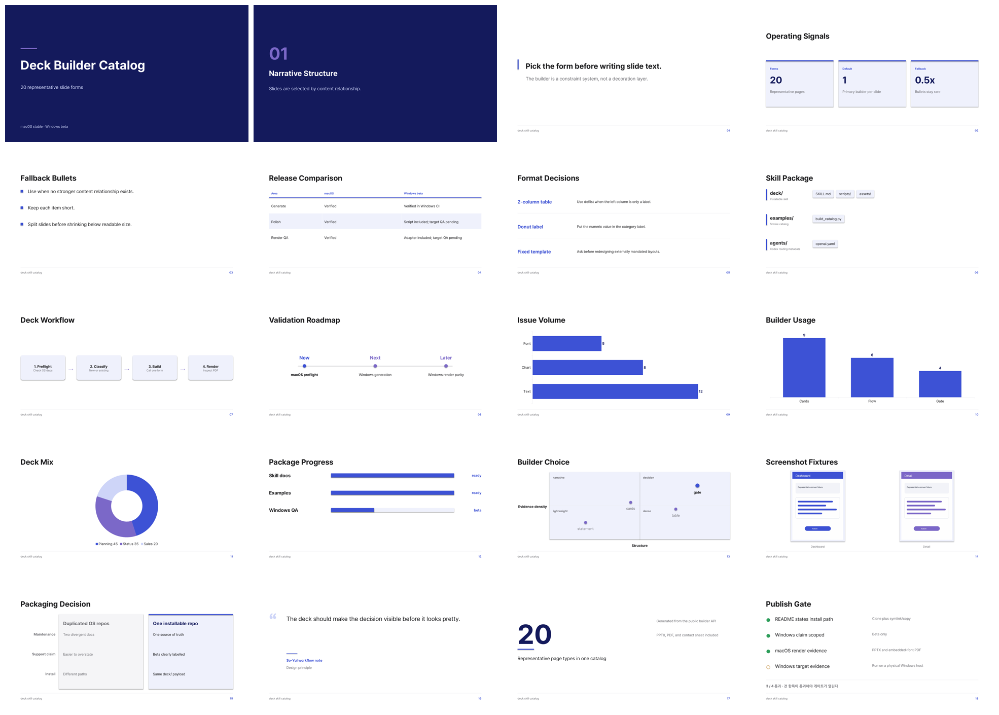

<h1 align="center">Claude Deck Skill</h1>

<p align="center">
  A Claude skill for building polished PowerPoint decks from reusable slide builders,<br/>
  with macOS and Windows runtime adapters plus PDF font verification.
</p>

<p align="center">
  <b>Status</b> · macOS validated · Windows adapter beta
</p>

<p align="center">
  
</p>

---

## Why This Exists

LLM-generated slide decks often fail in the same places: every idea becomes a
bullet list, typography drifts, PDF export substitutes fonts, and no one checks
the rendered output. This skill makes deck creation a repeatable workflow:
choose the right slide shape first, generate an editable PPTX, export to PDF, and
verify the rendered result.

The main packaging decision is one public repository, not separate macOS and
Windows repos. That keeps the actual deck builder from drifting. The trade-off is
that Windows support must stay labelled beta until it is validated on a real
Windows machine.

## Install

Clone this repository and copy or link the `deck/` folder into Claude's skill
directory.

macOS:

```bash
git clone https://github.com/So-Yul-e/claude-deck-skill.git
mkdir -p ~/.claude/skills
ln -s "$PWD/claude-deck-skill/deck" ~/.claude/skills/deck
```

Windows PowerShell:

```powershell
git clone https://github.com/So-Yul-e/claude-deck-skill.git
$target = "$HOME\.claude\skills\deck"
New-Item -ItemType Directory -Force $target | Out-Null
Copy-Item -Recurse -Force ".\claude-deck-skill\deck\*" $target
```

Codex can use the same payload: install or link `deck/` at
`~/.codex/skills/deck` (Windows: `$HOME\.codex\skills\deck`). The included
`deck/agents/openai.yaml` supplies Codex-facing display metadata; the workflow
contract remains shared in `deck/SKILL.md`.

On first use, ask Claude to run the runtime check. Installers should run only
after you approve them.

macOS:

```bash
bash ~/.claude/skills/deck/scripts/deps-macos.sh --check
bash ~/.claude/skills/deck/scripts/deps-macos.sh --install
```

Windows:

```powershell
powershell -ExecutionPolicy Bypass -File "$HOME\.claude\skills\deck\scripts\deps-windows.ps1" -Check
powershell -ExecutionPolicy Bypass -File "$HOME\.claude\skills\deck\scripts\deps-windows.ps1" -Install
```

## How It Works

Instead of asking the model to "make pretty slides," the skill gives it fixed
builders with locked spacing, typography, and visual hierarchy. The model decides
the content relationship, then calls the matching builder:

| Need | Builder |
|---|---|
| Title/opening | `cover()` |
| Section divider | `section()` |
| One strong claim | `statement()` |
| Equal text items | `bullets()` |
| Metrics/options | `cards()` |
| 3+ column comparison | `table()` |
| Label + description | `deflist()` |
| Hierarchy | `tree()` |
| Process | `flow()` |
| Roadmap | `timeline()` |
| Bar/column/donut data | `chart()` |
| Completion status | `progress()` |
| Two-axis map | `matrix()` |
| Screenshots/results | `shots()` |
| Before/after | `compare()` |
| User voice | `quote()` |
| Hero KPI | `stat()` |
| Go/no-go checklist | `gate()` |

`bullets()` is intentionally the fallback, not the default.

## Example

```python
import sys
sys.path.insert(0, "deck/scripts")

from deck import Deck

d = Deck(palette="indigo", footer="Project · Team")
d.cover("Quarterly Review", "What changed and what we do next", "2026 Q3")
d.cards("Top metrics", [("Activation", "42%", "+8pp"), ("Latency", "0.8s", "P95")])
d.flow("Delivery flow", [("Scope", "decide"), ("Build", "generate"), ("Verify", "render")])
d.save("review.pptx")
```

Build the 20-type catalog:

```bash
DECK_PY="$(bash deck/scripts/deps-macos.sh --python)"
"$DECK_PY" examples/build_catalog.py examples/output/deck-builder-catalog.pptx
```

Then render and verify it:

```bash
bash deck/scripts/render-macos.sh \
  examples/output/deck-builder-catalog.pptx \
  examples/output/deck-builder-catalog.pdf
```

## Runtime Choices

The shared deck engine is Python (`python-pptx` + Pillow). Rendering is
platform-specific because Office and LibreOffice behave differently across
operating systems.

| Platform | Status | Renderer path |
|---|---|---|
| macOS | Validated | LibreOffice isolated profile, PowerPoint fallback |
| Windows | Beta | PowerPoint COM PDF export, LibreOffice fallback |

Pretendard Regular/Bold are bundled so PPTX layout and PDF export do not depend
on whatever fonts happen to be installed on the machine. The font files remain
under the SIL Open Font License 1.1 in `deck/assets/fonts/OFL.txt`.

## Verified And Unverified

Verified:

- The installable [`deck/`](deck) payload passes the standard skill validator and
  its local [package contract tests](tests/test_package_contract.py).
- macOS generated the committed [20-slide builder catalog PPTX](examples/output/deck-builder-catalog.pptx)
  and rendered it to a [20-page 16:9 PDF](examples/output/deck-builder-catalog.pdf).
- [`verify_pdf_fonts.py`](deck/scripts/verify_pdf_fonts.py) confirmed embedded
  Pretendard Regular/Bold and rejected Arial Narrow/STHeiti fallback fonts.
- Windows scripts pass the [PowerShell contract checks](tests/test_windows_scripts.ps1),
  prefer PowerPoint's documented `ppSaveAsPDF` value (`32`), and fall back to
  LibreOffice. [Windows CI](.github/workflows/ci.yml) is configured to rebuild
  the 20-page PPTX; its first hosted run occurs after publication.

Not yet verified:

- Windows full render parity on a physical Windows machine.
- Linux dependency installation and render automation; no Linux adapter is claimed.
- Corporate brand inference. If a project has design tokens, map them into the
  palette explicitly.

## Validation Commands

```bash
python3 -m unittest discover -s tests -p 'test_*.py'
pwsh -NoProfile -File tests/test_windows_scripts.ps1
python3 /path/to/skill-creator/scripts/quick_validate.py deck
bash deck/scripts/deps-macos.sh --check
pdfinfo examples/output/deck-builder-catalog.pdf
pdffonts examples/output/deck-builder-catalog.pdf
```

## Project Layout

```text
deck/
  SKILL.md
  requirements.txt
  agents/openai.yaml
  scripts/
    deck.py
    polish.py
    deps-macos.sh
    deps-windows.ps1
    render-macos.sh
    render-windows.ps1
    verify_pdf_fonts.py
  assets/fonts/
    Pretendard-Regular.otf
    Pretendard-Bold.otf
    OFL.txt
examples/
  build_catalog.py
  make_gallery.py
  output/
    deck-builder-catalog.pptx
    deck-builder-catalog.pdf
    deck-builder-catalog-contact-sheet.png
tests/
  test_package_contract.py
  test_pdf_verifier.py
  test_windows_scripts.ps1
```

## Role And Scope

| Item | Detail |
|---|---|
| Creator | 윤소율 (So-Yul) |
| Scope | Workflow design, builder rules, implementation, packaging, and render QA |
| Team | One-person project with AI-assisted implementation and review |
| Period | 2026-08-04 to 2026-08-07 |

This repository packages So-Yul's existing personal deck workflow into a public,
portable Claude skill. The macOS behavior comes from the validated local skill;
the Windows adapter is a portability layer added for public use.

## License

Code is [MIT licensed](LICENSE). Bundled Pretendard font files are licensed
separately under the SIL Open Font License 1.1; see
[`deck/assets/fonts/OFL.txt`](deck/assets/fonts/OFL.txt).
